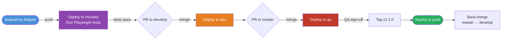
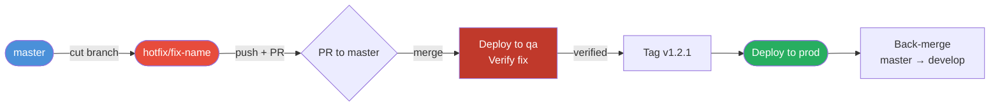
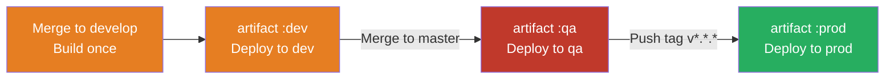

# Branching, Release & CI/CD Strategy

## Environments

| Environment | Purpose |
|---|---|
| **mocked** | Feature branch regression UI tests (Playwright) |
| **dev** | Integration environment after feature merges |
| **qa** | Pre-production validation |
| **prod** | Production |

---

## Branch → Environment Mapping

| Branch | Environment | Trigger |
|---|---|---|
| `feature/*` | mocked | push |
| `develop` | dev | PR merge from `feature/*` |
| `master` | qa | PR merge from `develop` |
| `v*` tag on `master` | prod | tag push |

---

## Standard Feature Flow



```
feature/my-feature
    → push → auto-deploy to mocked → run regression UI tests
    → PR to develop (tests must pass) → deploy to dev
    → PR to master → deploy to qa
    → QA sign-off → tag v1.2.0 → deploy to prod
    → back-merge master to develop
```

### Back-Merge After Prod Release

Always back-merge `master` into `develop` after a prod release to keep `develop` in sync with what's in production:

```bash
git checkout develop
git merge master
git push origin develop
```

---

## Hotfix Flow

Both QA and prod hotfixes follow the same flow — cut from `master`, which always reflects the latest prod release.



```
hotfix/fix-name  (cut from master)
    → push → PR to master → deploy to qa → verify fix
    → tag v1.2.1 → deploy to prod
    → back-merge master to develop
```

### Edge Case: master Has Moved Ahead of Prod

If `master` has received a new release merge but it has not yet been tagged/promoted to prod, cut from the specific prod tag instead:

```bash
git checkout -b hotfix/fix-name v1.2.0  # use the current prod tag
```

Then PR back to `master` and carefully review the merge diff, as `master` HEAD may contain newer changes. Document this scenario in your team runbook.

---

## CI/CD Pipeline Triggers

| Event | Action |
|---|---|
| Push to `feature/*` | Test → build → deploy to mocked → run Playwright regression suite |
| PR to `develop` | Gate on mocked regression tests passing |
| Merge to `develop` | Test → build → push artifact `:dev` → deploy to dev |
| Merge to `master` | Promote artifact to `:qa` → deploy to qa |
| Push tag `v*.*.*` | Promote artifact to `:prod` → deploy to prod |

### Key Principle: Build Once, Promote the Artifact

Build the image/bundle once on `develop`. Promote that exact artifact through qa → prod rather than rebuilding. This guarantees what was tested is exactly what ships to production.



---

## Branch Protection Rules

- `develop` and `master` require PRs — no direct pushes
- PRs require passing CI and at least one approval
- `master` additionally requires the regression suite to be green

---

## Tagging Convention

Use annotated tags for all releases:

```bash
git tag -a v1.2.0 -m "Release v1.2.0"
git push origin v1.2.0
```

Prod never deploys from a branch push — only from an explicit `v*` tag. This enforces a manual sign-off moment after QA validation.

---

## Production Rollback

Since prod deploys from tags, rolling back means redeploying an older tag — no branch changes required.

### Preferred: Re-trigger the pipeline

If your CI/CD platform supports it (GitHub Actions, GitLab, etc.), simply re-run the pipeline for the previous tag directly in the UI. No git commands needed.

### Alternative: Create a new tag on the old commit

```bash
git tag -a v1.2.1 v1.1.0 -m "Rollback to v1.1.0"
git push origin v1.2.1
```

This triggers the prod pipeline with the old artifact and leaves a clear audit trail in your tag history.

### What NOT to do

- **Don't delete and recreate an existing tag** — other people and pipelines may reference it
- **Don't `git reset --hard` on `master`** — destructive and rewrites shared history
- **Don't revert commits on `master` for a rollback** — reverts are for code fixes, not deployment issues
